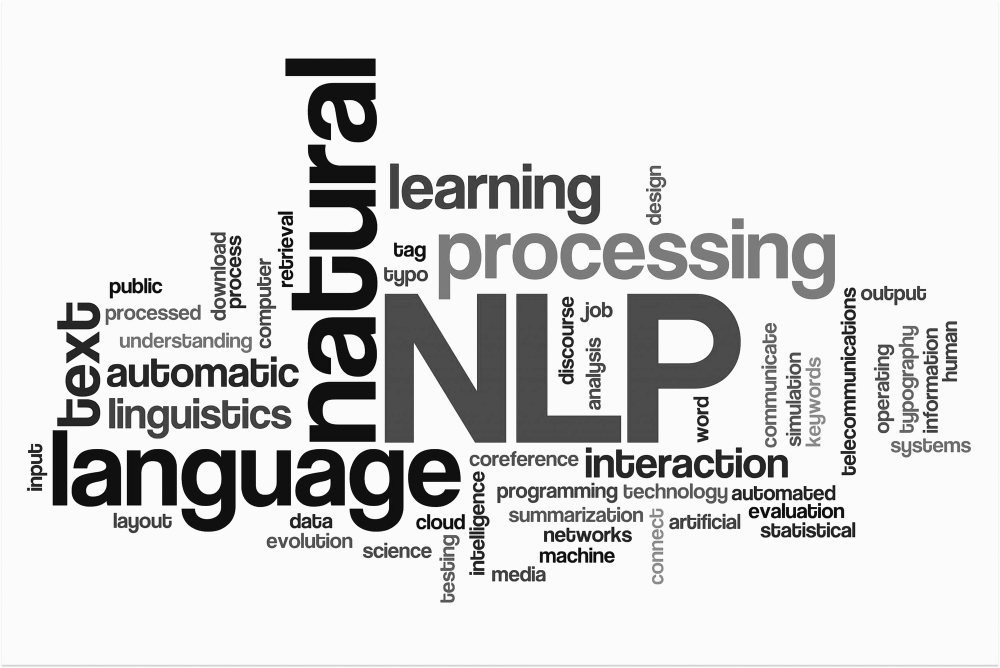
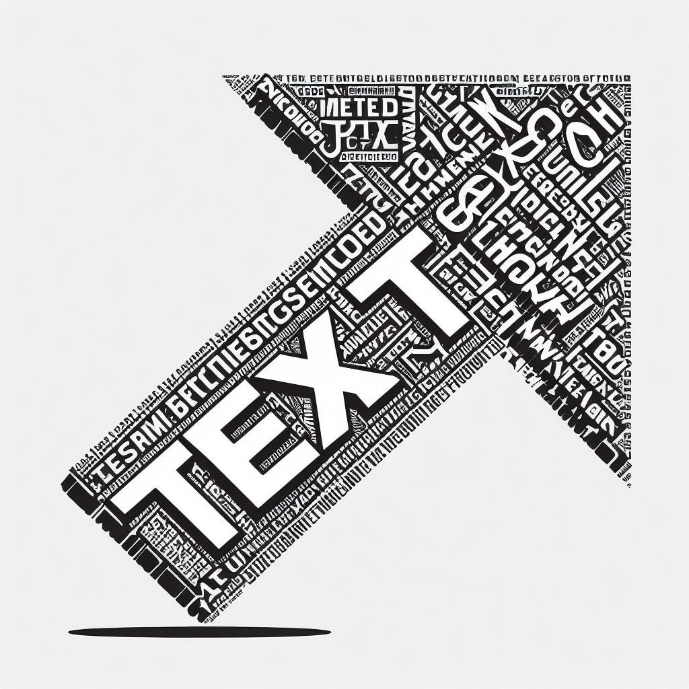
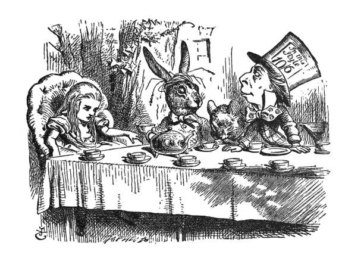

# CEIA - Procesamiento de Lenguaje Natural I

**Carrera de Especialización en Inteligencia Artificial (CEIA)**  
**Estudiante:** Ricardo Silvera (a2124)  
**Repositorio:** Desafíos de la materia Procesamiento de Lenguaje Natural I

---

## Descripción

  

    
  Este repositorio contiene los desafíos desarrollados durante el cursado de Procesamiento de Lenguaje Natural I. Cada desafío aborda diferentes técnicas y metodologías del PLN, desde vectorización básica hasta modelos de lenguaje con redes neuronales recurrentes.
  

  

    
  

---

## Desafío 1: Vectorización y Clasificación de Documentos

### Objetivo
Aplicar las técnicas de vectorización de documentos **bag-of-words** y **TF-IDF** para análisis de similaridad y clasificación de textos usando el dataset **20 Newsgroups**.

### Contenido
  

    

    
    

    

    

    En este desafío se implementó un sistema de clasificación basado en vectorización: primero se entrenó un modelo con textos de noticias categorizadas del dataset, luego, dado un texto nuevo, el sistema infiere su categoría utilizando <b>similaridad coseno</b>. El proceso compara el vector que representa el nuevo texto con todos los vectores de noticias previamente clasificadas, asignándolo a la categoría del vector con mayor similaridad coseno.
    

    

    También se implementó un modelo de clasificación  MultinomialNB - Naïve Bayes Multinomial que
    asume que las características (frecuencia de términos) siguen una distribución multinomial y calcula probabilidades condicionales basadas en frecuencias de las palabras.
    

    

    Este trabajo permitió comprender cómo representar texto (palabras, oraciones) mediante vectores numéricos, realizar operaciones matemáticas con ellos y, a partir de estos cálculos, establecer relaciones semánticas entre textos. El principal desafío se encuntra en crear representaciones vectoriales adecuadas que capturen efectivamente el significado semántico del contenido.
    

    

  

---

## Desafío 2: Word Embeddings con Word2Vec

### Objetivo
Entrenar embeddings personalizados usando **Gensim Word2Vec** sobre un corpus de letras de canciones para capturar relaciones semánticas entre palabras.

### Contenido

  

  

  Se entrenó un modelo <b>Word2Vec con Gensim</b> utilizando el corpus completo de letras de canciones de <b>Bob Marley</b>. El modelo capturó patrones lingüísticos y temáticos característicos del autor, permitiendo explorar relaciones semánticas entre palabras mediante cálculo de similaridad coseno en el espacio vectorial de embeddings.
  

  

  Con el modelo entrenado se realizaron búsquedas de palabras más y menos similares a términos de específios, revelando asociaciones semánticas coherentes con la obra del Marley. Para la visualización y análisis de estas relaciones, se aplicó <b>reducción dimensional a 2D</b> mediante t-SNE, preservando la estructura local del espacio de embeddings y permitiendo apreciar proximidades semánticas entre vectores de palabras.
  

  

  A pesar de las <b>limitaciones del corpus</b>, por su tamaño reducido, el modelo logró identificar clusters semánticos significativos agrupados por temáticas recurrentes en las canciones de Bob Marley: <b>espiritualidad y religión</b> (Jah, Babylon, rastafari), <b>amor y relaciones</b> (love, woman, heart), <b>cultura jamaiquina</b> (reggae, Kingston, rasta) y <b>emociones</b> (feel, soul, cry). Esta agrupación automática validó la capacidad del modelo para capturar el universo semántico del artista.
  

  

   Word2Vec demostró ser efectivo incluso con corpus pequeños especializados, capturando vocabulario y contextos específicos del dominio de las cacniones de Bob Marley, aunque la calidad de embeddings para términos raros se vio afectada por la baja frecuencia.
  

  

  

    
  

  

---

## Desafío 3: Generación de secuencias

### Objetivo
Entrenar diferentes modelos en base a un texto de entrada para generar nuevas secuencias a partir de secuencias de contexto con las estrategias de **Greedy Search** y **Beam Search Determístico** y **Estocástico**

### Contenido

  

  

  Se entrenaron 3 arquitecturas de redes neuronales recurrentes: <b>SimpleRNN</b>, <b>LSTM</b> (Long Short-Term Memory) y <b>GRU</b> (Gated Recurrent Unit). Como corpus de entrenamiento se utilizó el texto completo del libro <b>"Alicia en el País de las Maravillas"</b> de Lewis Carroll, tokenizado a nivel de caracteres con un vocabulario de 64 caracteres únicos.
  

  

  El principal desafío técnico fue el <b>overfitting severo</b> en modelos complejos debido al tamaño limitado del corpus. Se realizaron múltiples iteraciones ajustando hiperparámetros (dropout, learning rate, batch size, número de capas) hasta encontrar configuraciones aceptables. El tiempo de entrenamiento, especialmente con LSTM, requirió el uso de GPU para agilizar las pruebas y búsqueda de parámetros.
  

  

  Se implementaron cuatro estrategias de generación de texto: <b>Greedy Search</b> (determinístico con mecanismo anti-repetición), <b>Beam Search determinístico</b>, <b>generación con temperatura</b> (estocástico) y <b>Beam Search estocástico</b>. La comparación de estos enfoques reveló el trade-off entre coherencia y creatividad, donde la temperatura resultó ser el parámetro más crítico para controlar la diversidad del texto generado.
  

  

  Este fue el desafío más complicado de resolver, debido a los tiempos de entrenamiento y pruebas que lleva cada modelo. La infraestructura se convirtió en un elemento crítico para poder llegar a resultados aceptables. 
  

  

  
  

---

## Desafío 4: Traducción Automática con Seq2Seq

### Objetivo
Construir un modelo traductor de **inglés a español** utilizando la arquitectura **sequence-to-sequence (seq2seq)** con **encoder-decoder** basada en LSTM, empleando el dataset de traducciones del **Tatoeba Project**.

### Contenido

  

  

  Se implementó un modelo de <b>traducción automática</b> utilizando la arquitectura seq2seq con encoder-decoder. El dataset del Tatoeba Project proporcionó oraciones inglés-español para entrenamiento. El preprocesamiento incluyó tokenización separada para cada idioma.
  

  

  La arquitectura se dividió en tres componentes: 
  <b>Encoder</b>: LSTM que procesa la secuencia de entrada en inglés 
  
  <b>Decoder</b>: LSTM que recibe los estados del encoder y genera la traducción en español palabra por palabra.
  <b>Capa de embeddings</b>: para el inglés se utilizaron embeddings preentrenados de <b>GloVe</b>, mientras que para español se entrenaron embeddings desde cero.
  

  

  Se realizaron <b>múltiples experimentos</b> ajustando hiperparámetros: unidades ocultas, learning rates, y dropout para mitigar overfitting. El mejor modelo alcanzó ~71% de exactititud en validación, aunque con problemas de overfitting
  

  

  COmo traductor podemos decir que muy mal, en los resultados de las pruebas se ve que no logra realizar traducciones correctas, ni siquiera cercanas. El corpus reducido limitó la capacidad de generalización del modelo.
  

  

   Si embargo se ve como el modelo muestra señales qu está reconociendo la estructura del lenguaje, encuentra algunas correlaciones semánticas y de estructura gramatical, lo cual fue sorprendente, al menos  para mi, con un modelo tan pequeño.

  

---
## Conclusiones Finales

Al comenzar la materia me llamó la atención que se llamaran “Desafíos” a lo que comúnmente llamamos “Trabajos Prácticos”. Luego de recorrer el cursado, entiendo por qué: no solo invitan a aplicar conocimientos, sino a enfrentar problemas reales con criterio y creatividad.
Estos desafíos me exigieron comprender los contenidos teóricos, llevarlos a la práctica, trabajar con limitaciones de recursos y cumplir con tiempos de entrega.
También quedan abiertos: me motivan a seguir explorando, investigando y mejorando.

---

Ing. Ricardo Silvera

**Carrera de Especialización en Inteligencia Artificial**  
**Universidad de Buenos Aires - Facultad de Ingeniería**  
**2025**
